# Free-Education

This project has developed a free education platform. It provides equal access to educational resources in line with the aims of SDG 4 ---- to reduce inequality in access to education. This project was independently developed by Murui Xiao. Languages used: PHP, SQL, JavaScript, CSS. Project skills: UX design, UI design, software testing.

## demonstration

[](https://drive.google.com/file/d/1GKrVIH2CJel7WitmcGG-NYPE_9cH5E0J/preview)


```HTML
<iframe src="https://drive.google.com/file/d/1GKrVIH2CJel7WitmcGG-NYPE_9cH5E0J/preview" width="640" height="480" allow="autoplay"></iframe>
```

# User roles definition

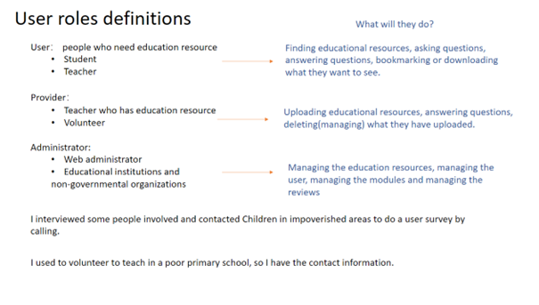

## Potential User Persona Profiles

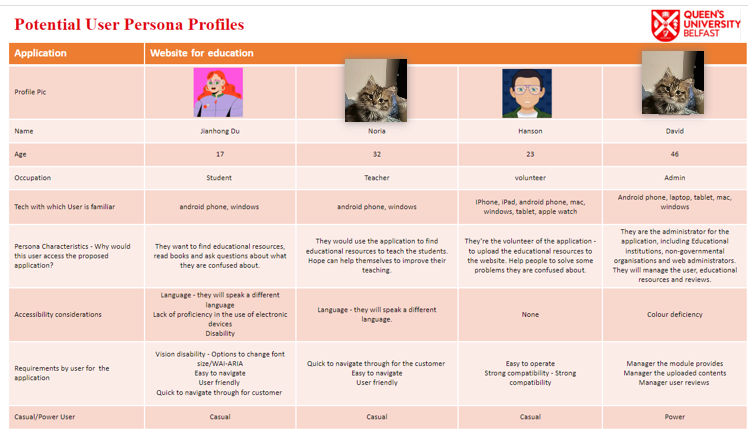

After the interview, the user profiles were categorised into four groups:

- Students - who are more interested in obtaining educational resources and asking questions. The corresponding needs of this group include viewing resources, querying resources, commenting on resources,
  and bookmarking resources.It's worth noting that comments are supposed to be reliable, which is user feedback given by tutor John after the demo. Relevant details will be described in detail at the
  iteration.
- Teachers - whose main need is to view some educational resources for lessons or to enhance their professional competence.The needs of this demographic are primarily to view resources, reviews, and discuss information with people who are also teachers.
- Volunteers - whose main purpose is to provide educational resources to remote areas and schools or to provide assistance to people in need. The main needs of this group are to upload and manage resources and to give help to those who need it.
- Administrators - assist in managing the site's users, user behaviour and resources.The main needs of this group should be to manage resources, users and reviews.

# Database Design

ER design: Draw an ER relationship diagram based on the requirements.

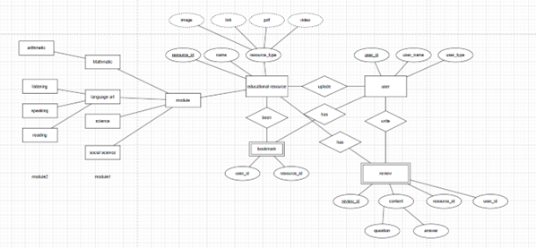

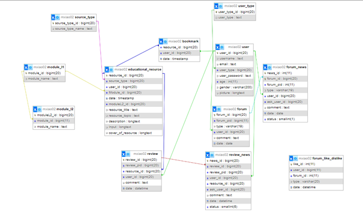

# Components and Modules

Project in the form of functional components to develop each function individually, each function is a separate module does not affect each other, combined together to support the entire project.

The development is divided into three modules: login-signup, Content, and administrator. The login-signup module contains the functions: register, login, and forget password. The pages involved are the login page signup page forget password page. Functions are accessed via buttons on the index page. The administrator module contains manage function for resource user and comment.

Most of the functionality is concentrated in the content module. Search function, upload function, admin function, comment function, reply to comment function. Involved pages modules, student, teacher creator, user, bookmark, news and most importantly content page. Because the Content page is the page that displays the content of each resource, and free access to educational resources is the core goal of the project.

## Details of every function

### Login

Log in with username and password and successfully access the functions you can only access if you are logged in. During the test, the feedback given by the system in different situations is tested by means of equivalent division, and whether the functions that can only be used in the logged-in situation can be used after a successful log-in.

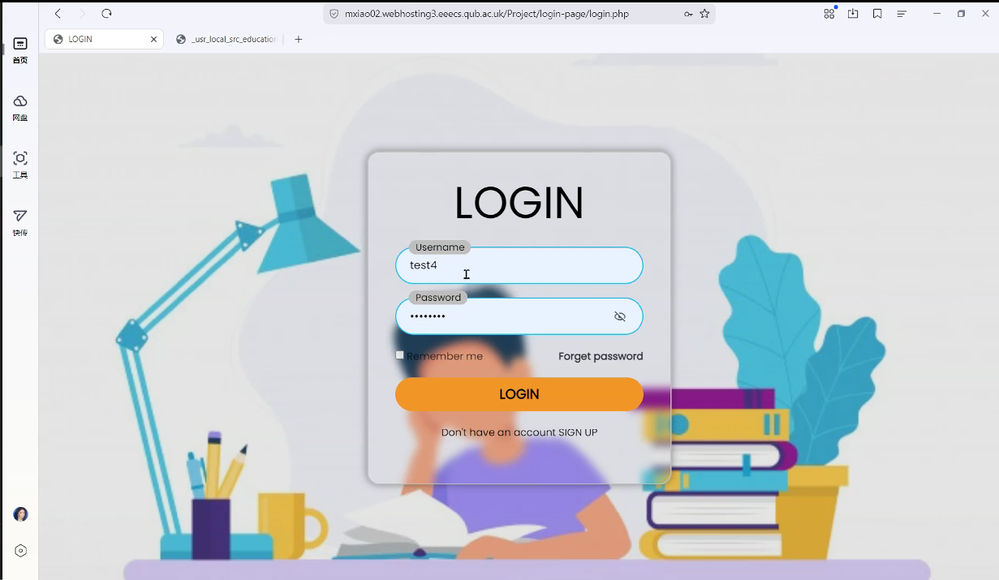

### Signup

Apply for a new account by email. in case of successful application, the system will give a prompt -register successfully.

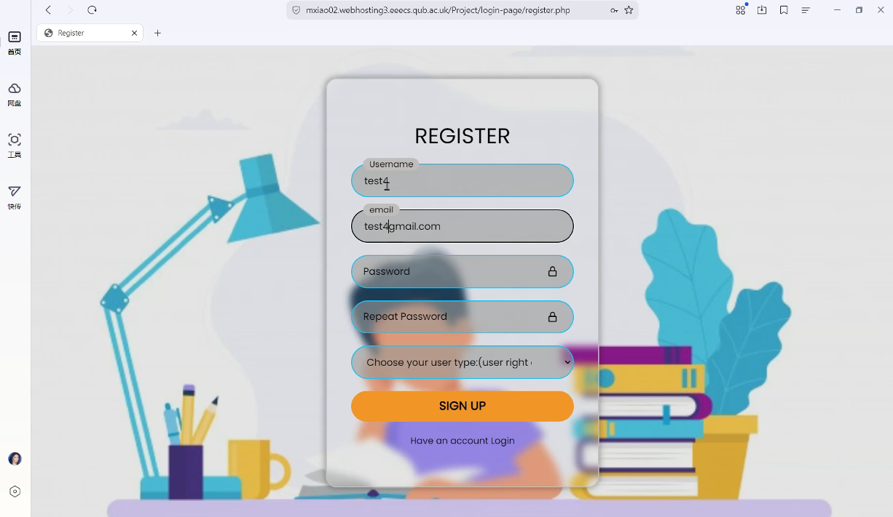

### Forget password

Reset password by Email and username. Test to see if you can successfully change your password and log in with the new one.

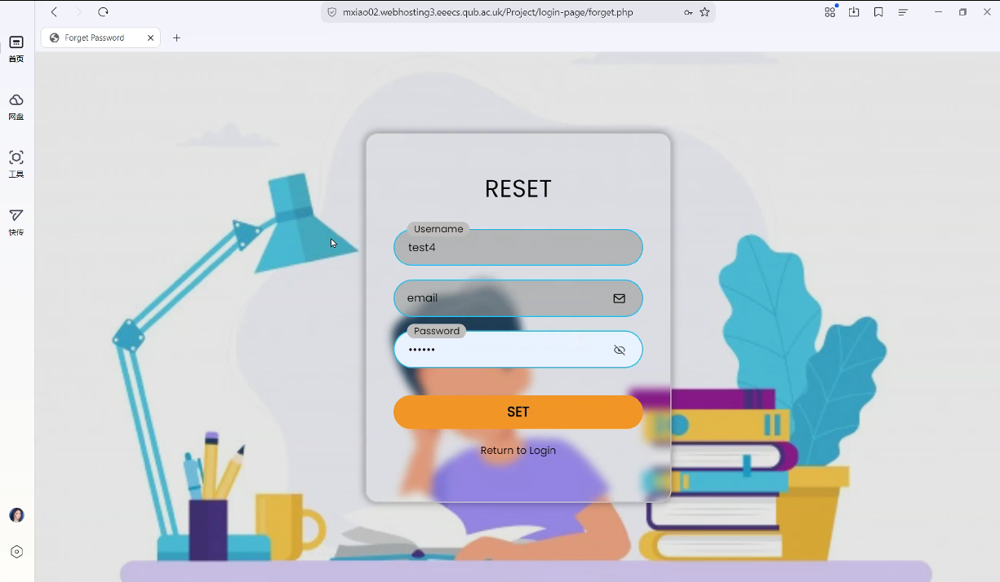

### Search bar

Search by keyword to find out the RESOURCE of related content on the module page. Test to see if you can search for relevant content, and try with symbols like "" to see if you get an error.

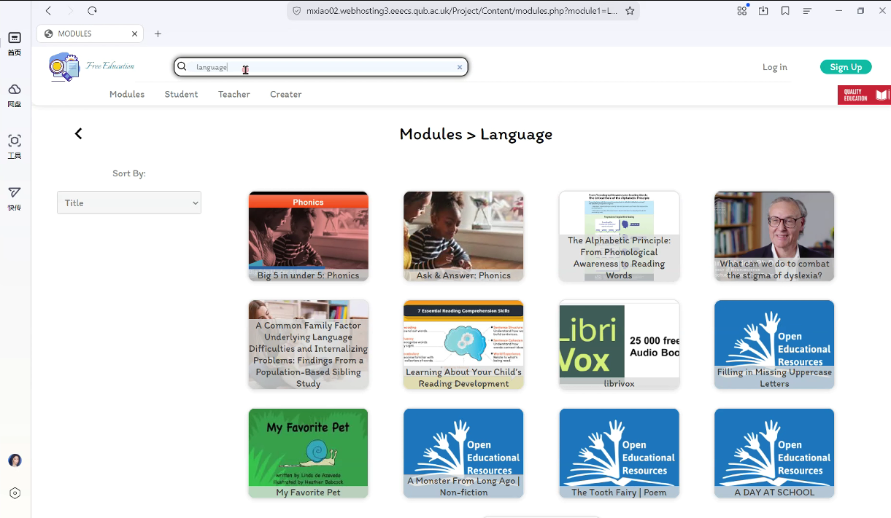

### Sort by selector

Changing the Sorting Method

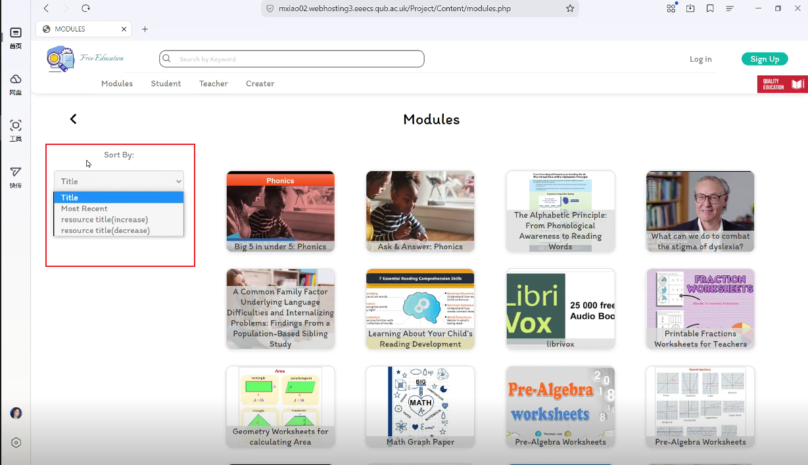

### Upload resource

Upload the appropriate content (file, link and text) by filling in the title, module, topic and selecting the type. When testing, pay attention to whether the file is successfully uploaded, whether the uploaded content is successfully displayed, and whether there is any error reporting.

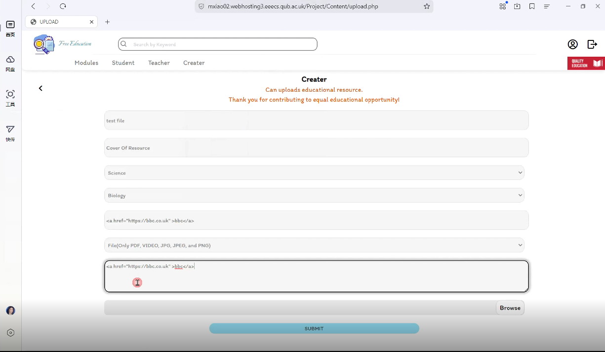

### Manage

This is achieved by two functions working together: editing content and deleting. The editing function is similar to the uploading function, but the editing function needs to show the original content in the initial state and update the changed part of the content after the change.

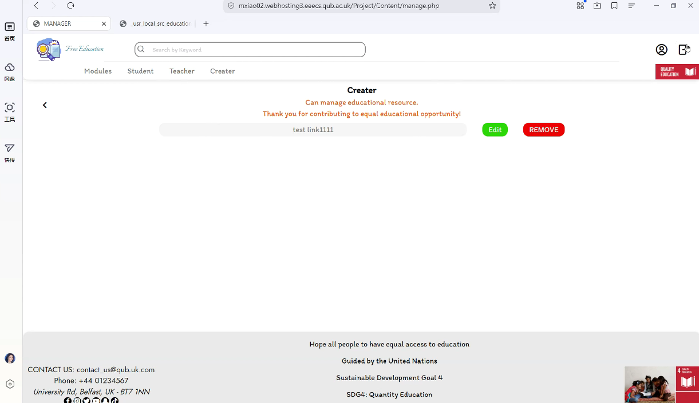

### Send review function

There are three pages(Content page, student page, teacher page) that cover the entire function, which is to send a comment out and this can be replied to, or it can be a secondary or tertiary comment that
replies to another comment.

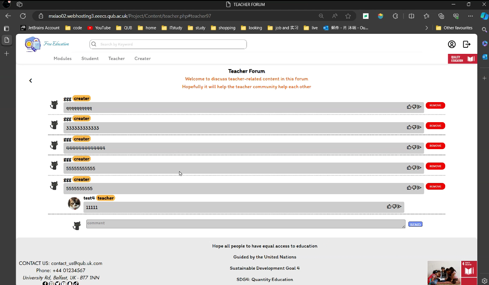


### Edit user information function

Upload a picture to change the user's avatar and change other information about the user. Test to see if you can successfully change the content.

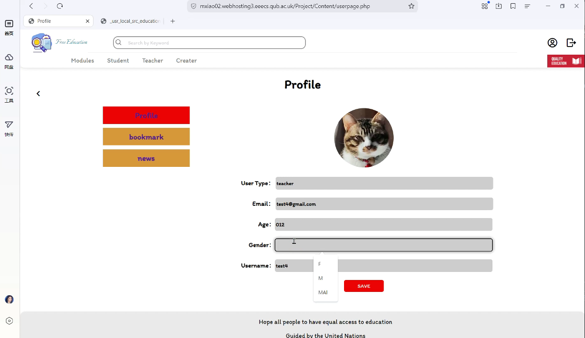

### Bookmark

Bookmark the user's favourite content. Convenient for users to view it twice.

# Deployment and Hosting

As the project is a website, all the data needs to be uploaded to the client, uploading the code to the server via FTP and configuring the database via phpMyAdmin.

# Security Architecture

Combine the login signup function developed by safety design with a database to verify the user's information to log in.

In addition to this, build anti-injection code to prevent the database from being compromised. The project does this by transferring symbols\ and htmlspecialchars(adslashes($value), ENT_QUOTES, 'UTF-8') function.

Prevents input from being a block of code like  `<a href="education.com">`education.com `</a>`, which results in the output being compiled when it is output.

Preventing database internals from being exposed by quotes by using “\”

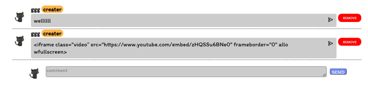

# Testing

During the development of the project, the features were tested for every successful feature developed, and after completing the development tasks, people were sought out to act as QA to test the entire website, and their feedback was collected, and changes were made in iterating on the locations where the project didn't quite live up to expectations.

# Maintenance and Iteration

After some tests and demonstrations, we listened to the suggestions given by the users to modify and improve some requirements of the project.

For example, the comments feature started out as just being able to send a comment, but at the suggestion of mentor John, it was changed so that comments that could be replied to were placed underneath the content of the resource. This makes each resource a discussion topic and allows users to better focus on discussing that one topic.

After discussion, that option does make more sense and is more in line with user behaviour. So an iteration was made to address the commenting feature.

# User Interface Design, System Design and Implementation

The entire design work is done through Figma. [LINK TO SEE](https://www.figma.com/design/fGV63OkEJrzIIqDPy734f6/CIT-project?node-id=0-1&p=f&t=0Shseqx916EV3hIu-0)

At the beginning of the design process, different screens and users were taken into account, and colours that would cause ambiguity for people with red-green colour blindness were avoided in order to take better care of vulnerable groups (Ivan Tuchkov, 22 August 2018). In order to make the user more visually comfortable and less fatigued, the colours chosen are not too contrasting.

In addition to this, screen adaptation has been taken into account, with targeted interfaces designed for both mobile phones and computers. The most common way to turn the header into a dropdown box is used (mollie, 28 April 2021). The search bar, login user page, and other commonly used items are designed in the header.

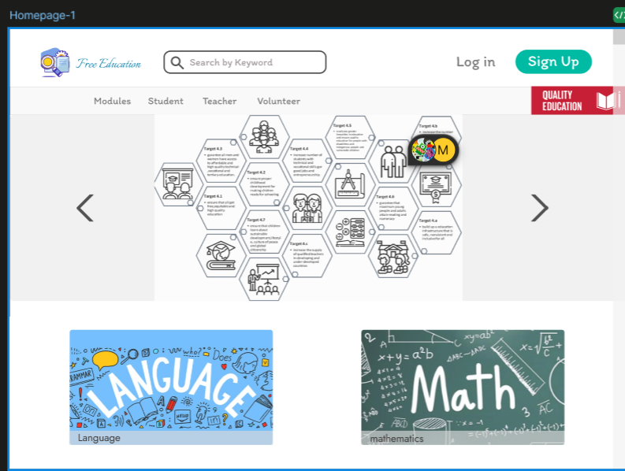

Rounded corners have been added to all square shapes during the design process to make them look
more comfortable (Andy Hertzfeld, May 1981). Undeniably, the design was initially inspired by Apple products. SDG4 related icons have also been added to the project to highlight the purpose of this project.

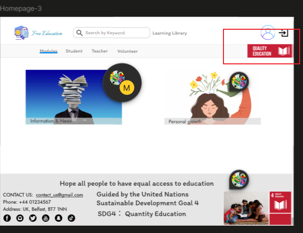

Considering that when many users participate in the discussion, there will be a lot of comments, it is designed to hover at the bottom of the screen when it doesn't reach the bottom, and when the page slides to the bottom, the comment function is at the bottom of the comments.

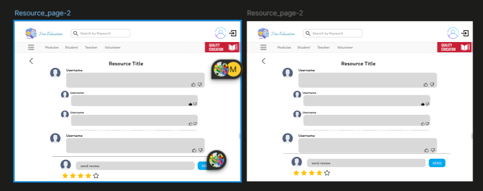

The ability to reply to comments is displayed by clicking on the reply button, which is also displayed at the bottom, making it easy for the user to output nor obscure the view.

Designed to generate different displays for hovering situations to indicate to the user that the position is meaningful.

# System Design

All pages are reachable by clicking. The header is fixed at the top and contains a navigation to help users use the site.All pages are linked together in the form of links, due to the existence of the login situation verification, if the current page is only logged in to access the situation, when the cookie is invalid, it will automatically jump to the login interface, any situation can be accessed to the page will not be affected.The automatic jumps are implemented with the help of JavaScript. For aesthetic reasons, many link jumps are implemented with the help of JavaScript.

The UI design is implemented through Style.css and Script.js, and the system program content is implemented through php and submit.js.

In the external personnel testing session, there is a questionnaire for the user experience, and after the statistics, the users are more satisfied with the interface and the system experience. The user evaluation of the system is simple and easy to operate.

# Verification, Validation and Testing

Two types of testing were experienced during development: one for a single feature and the other for the entire project. Which is for a single function, is to ensure that the function can run properly, and the output is as expected, without generating errors and faults.Another type of holistic testing was done by finding outsiders and requesting them to test the site as QA and collecting their feedback.

Testing during the development process provides significant help in refining the functionality and facilitates an iteration. For example, during testing there was user feedback about problems with the comment feature, and the current version of the comment feature is in a modified form based on that feedback.On top of that there was another issue that was tested that came from an unknown user. This was due to the fact that the site was injected with information from another site on a random occasion and caused the content to be overwritten. This led to the discovery that the development of the anti-injection feature was not comprehensive enough.After improving
the anti-injection feature and testing it by simulating a previous attack, it was confirmed that this feature has been refined.

Non-computer people were specifically sought out in the quest for testing, in the hope of better simulating what a random user would use. This is done at the end of a development lifecycle. As, this is the process of collecting suggestions for improvements to the project requirements while already ensuring that the current functionality will work. It can provide the requirements for the next iteration, the features that need to be improved or
added.


---

[**Acknowledgments**]()

I would like to express my deepest appreciation to my supervisor Mr. John Busch for his guidance, thoughtful comments, and recommendations throughout the preparation and completion of this project including design for the Database, UI design, UX design, and web development, for his encouragement and patience.

I am also grateful to the people who were so generous with their time in completing the questionnaire surveys which were a great help in designing the user experience: Yu Qian, Hansen Wei, Noria, Jianhong Du. Further, I would like to thank the Quality assurance: Nicholas Ladd, Hansen Wei, Yidi Peng, Yuqing Gao, Mian Sun, and Jianhong Du for testing the website and providing feedback.

---

BACHELOR OF SCIENCE

Computing and Information Technology

Queen’s University of Belfast

April 2024
