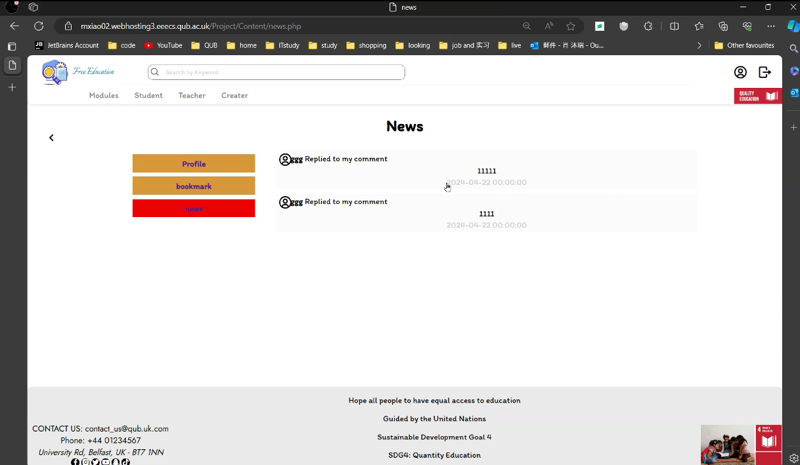

# Free-Education

This project has developed a free education platform. It provides equal access to educational resources in line with the aims of SDG 4 ---- to reduce inequality in access to education. This project was independently developed by Murui Xiao. Languages used: PHP, SQL, JavaScript, CSS. Project skills: UX design, UI design, software testing.

# User roles definition

## [**Potential User Persona Profiles**]()

After the interview, the user profiles were categorised into four groups:

- Students - who are more interested in obtaining educational resources and asking questions. The corresponding needs of this group include viewing resources, querying resources, commenting on resources,
  and bookmarking resources.It's worth noting that comments are supposed to be reliable, which is user feedback given by tutor John after the demo. Relevant details will be described in detail at the
  iteration.
- Teachers - whose main need is to view some educational resources for lessons or to enhance their professional competence.The needs of this demographic are primarily to view resources, reviews, and discuss information with people who are also teachers.
- Volunteers - whose main purpose is to provide educational resources to remote areas and schools or to provide assistance to people in need. The main needs of this group are to upload and manage resources and to give help to those who need it.
- Administrators - assist in managing the site's users, user behaviour and resources.The main needs of this group should be to manage resources, users and reviews.

# Database Design

ER design: Draw an ER relationship diagram based on the requirements.

# Components and Modules

Project in the form of functional components to develop each function individually, each function is a separate module does not affect each other, combined together to support the entire project.

The development is divided into three modules: login-signup, Content, and administrator. The login-signup module contains the functions: register, login, and forget password. The pages involved are the login page signup page forget password page. Functions are accessed via buttons on the index page. The administrator module contains manage function for resource user and comment.

Most of the functionality is concentrated in the content module. Search function, upload function, admin function, comment function, reply to comment function. Involved pages modules, student, teacher creator, user, bookmark, news and most importantly content page. Because the Content page is the page that displays the content of each resource, and free access to educational resources is the core goal of the project.

## Details of every function

### Login

Log in with username and password and successfully access the functions you can only access if you are logged in. During the test, the feedback given by the system in different situations is tested by means of equivalent division, and whether the functions that can only be used in the logged-in situation can be used after a successful log-in.

### Signup

Apply for a new account by email. in case of successful application, the system will give a prompt -register successfully.

### Forget password

Reset password by Email and username. Test to see if you can successfully change your password and log in with the new one.

### Search bar

Search by keyword to find out the RESOURCE of related content on the module page. Test to see if you can search for relevant content, and try with symbols like "" to see if you get an error.

### Sort by selector

Changing the Sorting Method

### Upload resource

Upload the appropriate content (file, link and text) by filling in the title, module, topic and selecting the type. When testing, pay attention to whether the file is successfully uploaded, whether the uploaded content is successfully displayed, and whether there is any error reporting.

### Manage

This is achieved by two functions working together: editing content and deleting. The editing function is similar to the uploading function, but the editing function needs to show the original content in the initial state and update the changed part of the content after the change.

### Send review function

There are three pages(Content page, student page, teacher page) that cover the entire function, which is to send a comment out and this can be replied to, or it can be a secondary or tertiary comment that
replies to another comment.

### Edit user information function

Upload a picture to change the user's avatar and change other information about the user. Test to see if you can successfully change the content.

### Bookmark

Bookmark the user's favourite content. Convenient for users to view it twice.

# [**Deployment and Hosting**]()

---

[**Acknowledgments**]()

I would like to express my deepest appreciation to my supervisor Mr. John Busch for his guidance, thoughtful comments, and recommendations throughout the preparation and completion of this project including design for the Database, UI design, UX design, and web development, for his encouragement and patience.

I am also grateful to the people who were so generous with their time in completing the questionnaire surveys which were a great help in designing the user experience: Yu Qian, Hansen Wei, Noria, Jianhong Du. Further, I would like to thank the Quality assurance: Nicholas Ladd, Hansen Wei, Yidi Peng, Yuqing Gao, Mian Sun, and Jianhong Du for testing the website and providing feedback.

---

BACHELOR OF SCIENCE

Computing and Information Technology

Queen’s University of Belfast

29th April 2024
